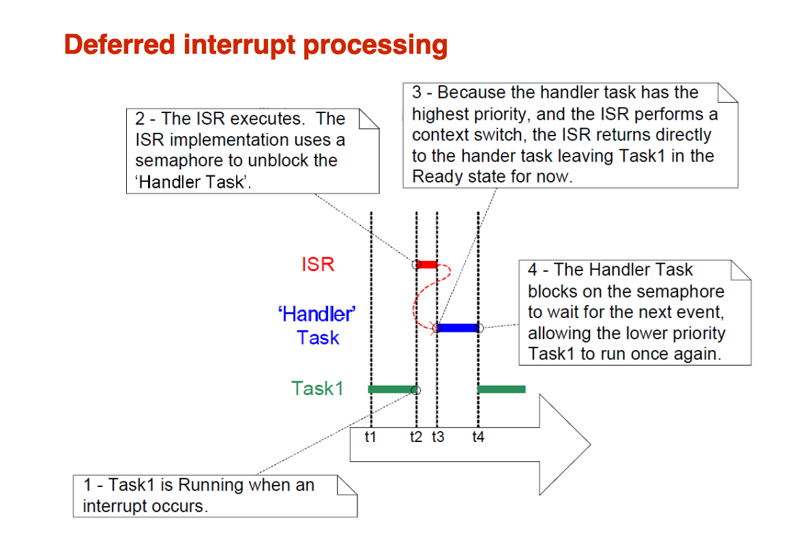
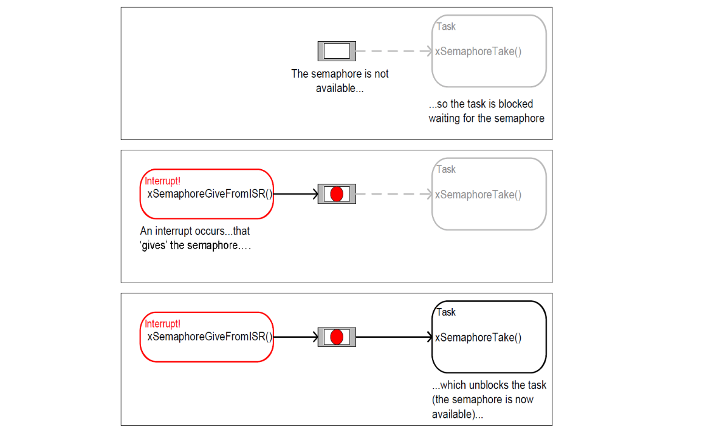
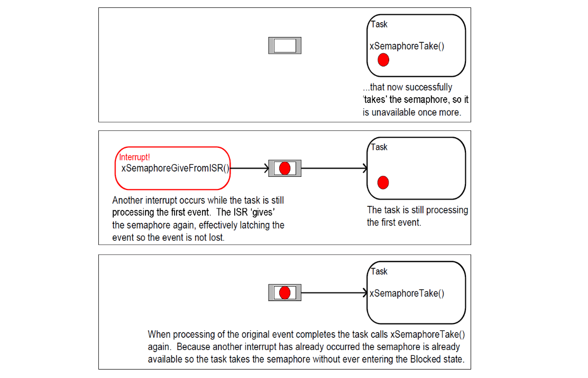

# Lec 1
## Multitasking in a single core environment

### Switching form one process to another is called context switch
- Context holds all the
information that is required to
put a process on hold and
continue execution at a later
time without affecting the
computations of the process

## Process states

- Running - process is running
- Ready – waiting to be
scheduled to execute
- Blocked – process is not ready
to run and is waiting for
something, for example on a
lock of data from a queue
-  Suspended – process has
been put on an explicit hold
state and can be resumed only
by an OS call

## Thread safety

- In a multithreaded system a piece of code can be executed by multiple
threads at the same time
- A thread safe piece of code guarantees safe execution by multiple threads
at the same time
- When code is executed in a system where threads are executed in a
shared address space simultaneous execution can lead to memory
corruption and/or unexpected program behaviour

- A variable that is shared between two threads (tasks) must be declared
volatile to tell the compiler that the value of the variable can change
outside the normal program flow

### Different implementation approaches

- Avoid shared state
    - Code can be interrupted and reexecuted by the same thread or another
thread and still correctly complete original execution (and reexecuted
as well) 
    - State information must be saved in variables that are local to each
invocation of the code (usually on stack). All global/non-local data
access must be atomic

- Thread local storage
    - State variables are localized so that each thread has its own private copy

- Mutual exclusion
    - Access to shared data is serialized using mechanisms that ensure only one
thread accesses the shared data at any time

- Atomic operations
    - When shared data is accessed by using an operation which can not be
interrupted by other threads the operation is said to be atomic
    - Atomic operations form the basis of thread locking mechanisms and are
usually used to implement mutual exclusion primitives

# Lec 2
## Task management
- When a task is created the kernel allocates memory for the
task
- FreeRTOS kernel stores context (state) of the task in TCB
- TCB contains the CPU state (stack pointer, registers, etc.)
and other information needed by the scheduler
- If a task is deleted then the memory allocated be the
kernel is freed
- **When a context switch takes place kernel
restores the stack pointer of the task
to run from TCB and returns to the task**

## Semaphores
- Semaphores are a signaling mechanism that can be used for various
purposes
    - Mutual exclusion – to protect a resource from simultaneous access
    - Signaling events to tasks
    - Counting resources etc.
- Semaphore can be though as a variable that has a value
- Two operations can be performed on a semaphore:
    - Take: decrement value by one. (P)
        - If value is zero a task may opt to wait (block) until it is non-zero
    - Give: increment value by one (V)
        - If value is zero this may result in unblocking a task that is waiting on
            the semaphore

### Binary semaphores
- Has two states: empty and full
- If semaphore is already full an extra give is ignored
- Usually used for syncronizing between tasks (or ISR and task)
- Empty when created

### Counting semaphores

- Have maximum count value
- Usually used for counting events or resource management
- Typical case of counting is ”producer-consumer”
    - One task ”produces” (give semaphore) events the other
    ”consumes” (take semaphore) events
- Resource management
    - Create the semaphore with maximum count equal to available
    resources and set it also as maximum count value
    - Resource may only be used after succesfull take of the semaphore

#### Mutex
- Mutex is a binary semaphore with priority inheritance mechanism
- If the mutex holder has lower priority than the task that is blocking
on the mutex the holders priority is temporarily raised to the level of
the blocked task

## Producer – consumer
    - The producer does the following repeatedly:
        - take(emptyCount)
        - take(useQueue)
        - putItemIntoQueue(item)
        - give(useQueue)
        - give(fullCount)
    - The consumer does the following repeatedly
        - take(fullCount)
        - take(useQueue)
        - item ← getItemFromQueue()
        - give(useQueue)
        - give(emptyCount)

# Lec 3

## Simple server system
- Two key parameters:
    - Arrival rate λ (transactions per second)
    - Service rate μ (transactions per second)
- We assume that λ < μ
    - If not system is never in a steady a state
    - Over a long period of time flow in = flow out

 ## Introduction to queues

### Queues
- In a system that consists of tasks that run independently it is very likely that
the tasks will need to communicate with each other
- A simple form of communication is to send signals to other tasks using
semaphores. However the semaphores carry very little information
(given/not given) which calls for communication method that can carry
more information
- FreeRTOS provides queues that can hold a finite number of fixed size data
items
    - The number of items that a queue can hold is called its length
    - Both the length of the queue and the size a data item is determined
when the queue is created
- It is possible for tasks to block on queue read and write if needed
    - The most typical case is to block on reads (many senders, one
    receiver)
    - The return value will tell if read/write succeeded – it is utterly important
    to check the return values   
### Queue creation

- Queues can be created before the scheduler is started
    - FreeRTOS documentation says nothing about sending to queue
    outside a task context so don’t send anything to the queue until
    scheduler is running
    - You can pass queue handles to a task as the task parameter
- Note that data that is sent to the queue is copied in to the queue
    - All the memory that queue uses is allocated when the queue is created

### Working with large data

- Copying large amounts of memory to and from queue is time consuming. If
you need to pass a large amounts of data consider using a buffer allocation
scheme and pass pointers to buffers in the queue
- When pointers are passed take extreme care that the pointers you pass
remain valid for the whole time they are in the queue
- If you have an allocation/deallocation scheme make sure that you free
memory when you don’t need it. A memory leak can kill your application at
an unexpected moment
    - Always check the return values from memory allocation and queue
    read/write to know if your operation was successfull

# Lec 4

### Two processor modes

- **Thread mode** for executing user applications. Processor enters Thread
mode when it comes out of reset
- **Handler mode** for handling exceptions. Processor returns to Thread
mode after finishing exception processing

- Two privilege levels
    - Privileged – no instruction restrictions and unlimited access to all
    resources
        - **Handler mode** is always privileged
    - Unprivileged – some special instructions are not available and access
to system resources is limited
- **Thread mode** privilege level is controlled by CONTROL register. After reset
processor is in privileged thread mode.
    - If user switches to unprivileged mode the mode can only be changed
    by entering handler mode (eg. through supervisor call) since changing
    CONTROL register is allowed only in privileged mode

## Interrupts

- Interrupts are a mechanism which
allows processor to respond
quickly to events
    - For example when IO-device
    switches to ready-state
- Current execution is interrupted
and processor jumps to interrupt
handler code. After handler is
executed processor resumes
execution at the address where
the interrupt occured
- Operating system may and often
does perform a context switch
when the interrupt handler returns

### Interrupt is hardware coerced subroutine

- Ordinary subroutine needs only to save registers that calling convention
defines as callee saved
    - C/C++ compiler takes care of saving registers for you
- When you call an ordinary subroutine you can prepare for subroutine call
by saving important registers that may be modified by the subroutine
- Interrupts are triggered independently of the program execution thus
interrupt handler needs to ensure that interrupted program is not disturbed
    - Interrupt handler needs to save all registers that it modifies
    - Flags must be preserved
        - For example interrupt can occur between comparison instruction
        and conditional branch
- When an interrupt routine is written in C/C++ you must tell the compiler
that the routine is an interrupt handler
    - `GCC: void handler() __attribute__ ((interrupt ("IRQ")));`
    - Our ARM cortex-M3 is an exception (see next)

- ARM Cortex-M processors target low-end and mid-range embedded
systems
- ARM has implemented some extra hardware measures in Cortex-M3 to
simplify the way interrupt handlers are written
    - ARM has laid out recommened register usage convention that defines
    which registers need to be saved by a called function
    - ARM has implemented hardware that saves the registers that are not
    saved when a function is called
    - If compiler follows ARM register usage convention interrupt handler can
    be an ordinary function (no special attributes are needed)
        - GCC follows ARM register usage convention
- Cortex-M3 has two stack pointers. A common way is to use MSP for OS
and Interrupts and PSP for user tasks
    - PSP = Process stack pointer
    - MSP = Main stack pointer

#### FreeRTOS uses the following ISRs on Cortex-M3:
- Systick for time keeping
- PendSV to perform a context switch
- SVC (Supervisor call) for starting the first task
    - Makes only one SVC. Rest is handled in Systick and PendSV

## FreeRTOS context switch

- FreeRTOS scheduler is very light weight. It maintains queues of ready
tasks for every priority
- PendSV handler saves current contexts and gets a pointer to the context to
return to

## Critical section
- FreeRTOS has functions for entering and exiting a critical section
- Avoid using critical sections and use operating system syncronization
instead
    - Critical sections increase interrupt latency
- Critical sections on Cortex-M3 can be avoided by using atomic types with a
compiler that implements them with low level primitives
    - Atomic integral operations are lock free if they use CPU special
instructions (ldrex/strex)
- C++11 supports atomic types
    - GCC uses ldrex/strex on Cortex-M3
- C11 supports atomic types
    - _Atomic qualifier
    - Include <stdatomic.h> for convenience macros, for example: atomic_int
    - GCC uses ldrex/strex on Cortex-M3

# Lec 5

## Syncronization with binary semaphores

- A binare semaphore can be used to unblock a task each time a particular
interrupt occurs which effectively synchronizes the task with the interrupt
- This allows majority of the interrupt processing to take place within the task
and only minimal processing remains in the ISR
    - The handler task must be on a priority level that is higher than normal
    tasks to ensure that handler task pre-empts other task when unblocked
    by the ISR
    - The processing is said to be deferred to a task
    - A very limited set of FreeRTOS calls can be made within an ISR
    whereas a handler task can freely use the whole FreeRTOS API

## Deferred interrupt processing


## How to synchonize a task with an ISR



## Cortex-M3 interrupt handling

- There are three places where interrupts/exceptions can be enabled or
disabled
    - Processor core (PRIMASK register)
        - Can prevent all exceptions except for Reset, NMI, and Hard Fault
    - Priority based masking (BASEPRI register)
        - Prevents all interrupts with the same or lower priority as BASEPRI
        value
- NVIC
    - Enable/disable specific interrupts (regardless of assigned priority)
    - Used with peripherals
- FreeRTOS takes care of handling PRIMASK and BASEPRI
- Use FreeRTOS API to enable/disable interrupts if you need to
    - Normally avoid enabling/disabling all interrupts
    - If there is a need to disable interrupts is let FreeRTOS handle it
    - Use OS calls for syncronization, message passing etc.
    - Usually device driver writer needs to enable/disable interrupts on NVIC
## Cortex-M3 interrupt handling and FreeRTOS
- FreeRTOS does not provide API for managing NVIC (Cortex-M3 interrupt
controller)
    - Enabling/disabling interrupts on NVIC is frequently needed when
    working with peripherals
    - NVIC allows enabling/disabling interrupts from a specific device
- FreeRTOS allows you to write ISRs that will never be disabled by the
kernel
----
- When FreeRTOS kernel enters (an internal) critical section it uses
BASEPRI to mask interrupts
- The highest priority that FreeRTOS kernel disables is defined in
FreeRTOSConfig.h
- `configLIBRARY_MAX_SYSCALL_INTERRUPT_PRIORITY` tells the
highest priority that will disabled by the kernel
- Interrupts that make FreeRTOS calls must run on priority that is equal to or
lower than `configLIBRARY_MAX_SYSCALL_INTERRUPT_PRIORITY`
- Number of priority levels depends on the ARM variant. Our LPC1549
implements 8 priority levels (3 priority bits)
- A lower number means higher priority so your own interrupts should run at
`configLIBRARY_MAX_SYSCALL_INTERRUPT_PRIORITY` (+offset of
your choice)
- Beware of overflow – a big offset may cause an overflow that makes
your interrupt run on a priority that FreeRTOS does not manage
----

## LPC1549 peripherals and interrupts

- Initialize peripheral
    - Turns on clocking and power to the device
    - Init-function can be found in the chip library (or read the processor
    manual – the ultimate source of information)
- Configure peripheral
    - Functions are in the chip library
    - Which of them to call requires reading the manual and maybe looking
    at the library function implementation
- Write an ISR
    - Check from the manual what you need to do to acknowledge the
    interrupt
    - Do things that don’t require much processing (for example: get received
    data from the hardware)
- Do the rest in a task
    - Start peripheral operation
    - For example: protocol stack, data processing, ...

## Example of a (complex) ISR

```c
extern "C" {
  void UART0_IRQHandler(void) {
    portEND_SWITCHING_ISR(u0 -> isr());
  }
}
void Uart::receive() {
  int status;
  status = u -> LSR;
  while (status & LSR_RECEIVE) {
    if (!rx.put(u -> RBR)) dropped++;
    if (status & LSR_RECEIVE_ERROR) {
      error++;
    }
    status = u -> LSR;
  }
}
void Uart::transmit() {
  int count;
  char ch;
  for (count = 0; count < FIFO_SIZE; count++) {
    if (tx.get(ch)) {
      u -> THR = ch;
    } else {
      break;
    }
  }
}

bool Uart::isr() {
  portBASE_TYPE xHigherPriorityWoken = pdFALSE;
  bool rcv = false;
  int status;
  do {
    status = u -> IIR & INTR_ID_MASK;
    if (status & INTR_RCV_AVAIL) { // any type of receive event
      receive();
      rcv = true;
    }
    if (status == INTR_XMT_EMPT) {
      if (tx.empty()) {
        u -> IER = RXINT; // disable TXINT if buffer is empty
      } else {
        transmit();
      }
    }
  } while (status != INTR_NOTHING);
  if (rcv) {
    xSemaphoreGiveFromISR(uart_binary, & xHigherPriorityWoken);
  }
  return xHigherPriorityWoken;
}
```
# Lec 6

## More about locking ...

- FreeRTOS API calls are thread safe (naturally)
    - For example sending to or receiving from a queue does not require
locking to function correctly
- Sometimes locking is needed to enforce a usage policy on a higher
abstraction level
    - Consider a case where ISR receives characters from UART and sends
    them to queue
        - Getting data from a queue does not require locking to work
        correctly but we may wish to give callers exclusive access to the
        queue for successive reads
```c
int readline(char * line, int len) {
  /*
  Mutex guarantees that caller
  can read the line without other
  tasks ”stealing” characters
  from receive queue.
  */
  take mutex
  while (count < maxlen) {
    read from queue
    increment count
    break on linefeed
  }
  give mutex
  return count
}
```
## FreeRTOS stacks

- FreeRTOS allocates a private stack space for each created task
- Task stack space is used for local variables, function calls and to store
context when task is switched from running state to other state (ready,
blocked)
    - Saving the context requires 16 x 4 bytes = 64 bytes
    - Function calls may require 40 bytes of RAM just to save the callee
saved registers. Local variables and parameters come on top of that
- FreeRTOS minimal stack space 128 x 4 bytes is as the name states
minimal and enough only for small tasks that do not use library functions
- C/C++ library calls require that stack space is increased over bare
minimum
- Kernel aware debuggers can display task stack usage statistics

- FreeRTOS maintains a separate stack for tasks and interrupts on Cortex-
M3
    - MSP for interrupts
    - PSP for tasks
- Task stacks are allocated when a task is created and when a context
switch occurs the new running tasks stack pointer is set to PSP
- Interrupts use the stack allocated by the compiler
    - This is the same stack that main() uses before schuler starts
    - When the scheduler starts the stack is reset and it is used for interrupts
    → with FreeRTOS any stack based variable in `main()` will not be
    accessible after scheduler is started

## Guidelines for good realtime performance
- [x] Analyze your response time requirements :tada:
- [x] Let OS do the waiting :tada:

1. Use blocking system calls
    - **Rule of thumb**: If you have a blocking system call you don’t need any
additional delays (explicit delays increase your task response time)

2. Analyze where your program spends most of it’s time (and why)
    - **Rule of thumb**: If single task is using more than 50% of the CPU time
then check if you have busy waits/polling to eliminate

3. If you can’t use blocking calls check if it possible to change the code to use
blocking calls

4. If you must poll then wait or yield to give other tasks a chance to execute
    - Match the wait time with the frequency to the events that you poll
        - **Rule of thumb**: wait time must be equal to (or lower than) the time
between events that you poll
    - Yield gives up the rest of your current time slice

